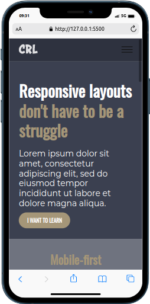
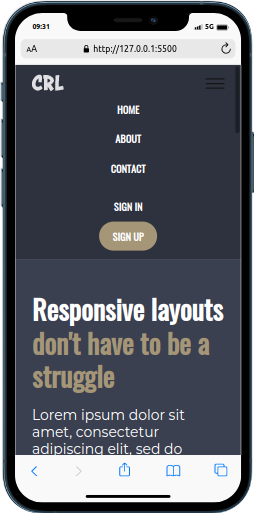
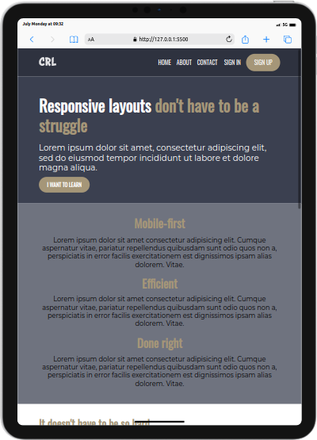
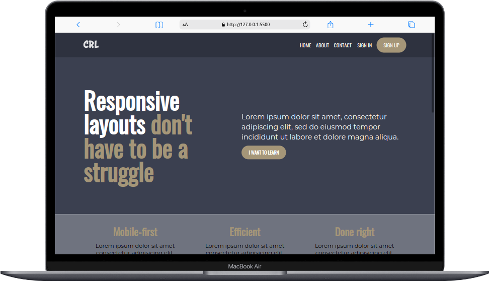
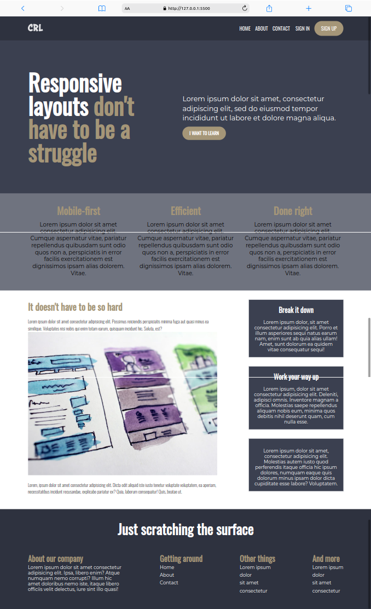

# responsive-layout-with-navigation-bar
This is a solution to the final challenge on Kevin Powell's 21-day conquering responsive layout. 

## Table of contents
- [Overview](#overview)
  - [The challenge](#the-challenge)
  - [Screenshot](#screenshot)
  - [Links](#links)
- [My process](#my-process)
  - [Built with](#built-with)
  - [What I learned](#what-i-learned)
  - [Continued development](#continued-development)
- [Author](#author)
- [Acknowledgments](#acknowledgments)

## Overview

### The challenge
Users should be able to 
- View the optimal layout for the content depending on their device's screen size, i.e Mobile, Tablet or Desktop
- See hover states for all interactive elements on the page
- Toggle the navigation bar when using mobile screen

### Screenshot

#### Links
- Github Repository link - [Manuelcoder02](https://github.com/Manuelcoder02/responsive-layout-with-navigation-bar)
- Live Site link - https://responsive-layout-with-navigation-bar.vercel.app/

## Process

### Built with
- Semantic Html5 Markup
- CSS custom properties
- Flexbox
- Javascript

### What I learned
- Adding a toggle on a navigation bar
- Creating a well structured resonsive website
- Working with keyframes

### Continued development
- Creating a well structured responsive website
- Keyframes
- Navigation bar

## Author
- Website - [Responsive layout](https://responsive-layout-with-navigation-bar.vercel.app/)
- Twitter - [juniorDev @sotundenuel](https://www.twitter.com/@sotundenuel)
- Instagram - [
- Thread -
- Whatsapp -
- Facebook -

## Acknowledgements
Thanks to everyone who supported me in this project.

